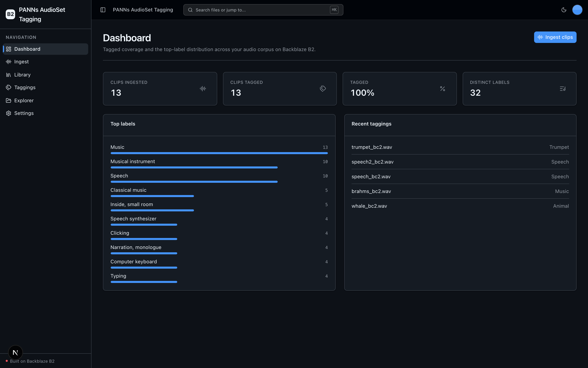
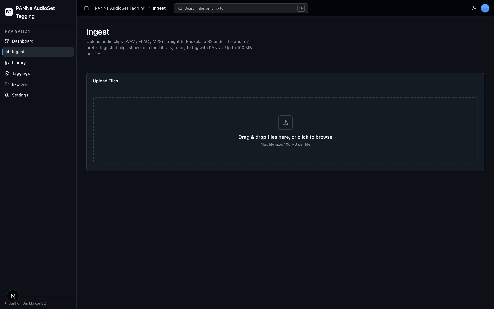
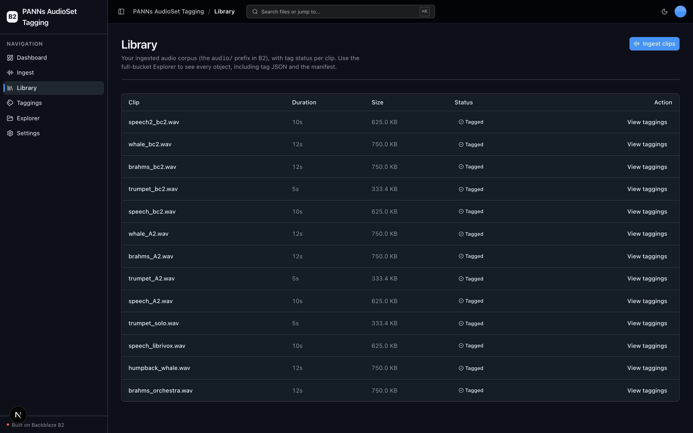
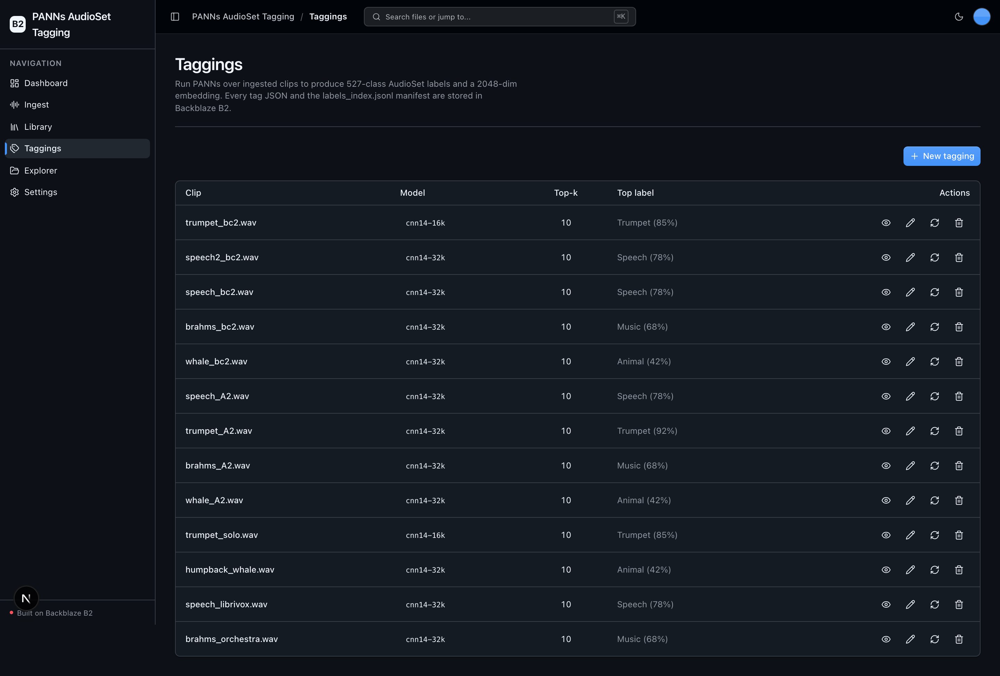
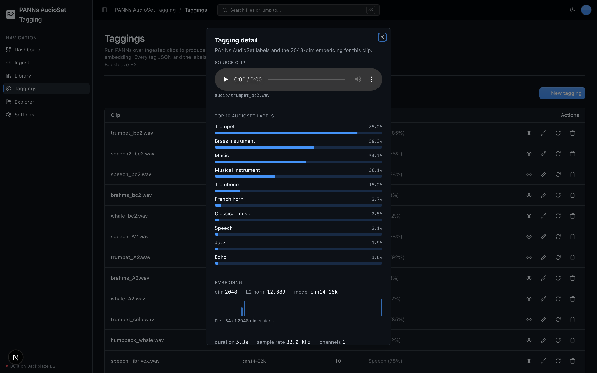

<!-- last_verified: 2026-08-12 -->
# PANNs AudioSet Tagging

Tag large collections of unlabeled audio with **AudioSet** event labels using
**PANNs** (Pretrained Audio Neural Networks, `qiuqiangkong/audioset_tagging_cnn`)
running **locally** — no second API key, just **[Backblaze B2](https://www.backblaze.com/sign-up/ai-cloud-storage?utm_source=github&utm_medium=referral&utm_campaign=ai_artifacts&utm_content=b2ai-panns-audioset-tagging)**
credentials. For each clip PANNs produces a 527-class label-probability vector and
a 2048-dim CNN embedding; the app extracts the top-k labels, writes a per-clip tag
JSON to B2 under `tags/`, and maintains a `labels_index.jsonl` manifest that
downstream training/search pipelines read over the S3-compatible API. Every
artifact — source audio, tag JSON, embedding, manifest — lives in B2. **B2 is the
storage layer for a bulk audio-ML workflow.**

**What you get out of the box:**
- Local PANNs AudioSet tagging — 527-class probabilities + 2048-dim embedding per clip, top-k extraction, **CPU by default** (GPU auto-detected)
- Bulk audio ingest to B2 under `audio/…` (WAV / FLAC / MP3)
- Per-clip tag artifacts in `tags/…json` and a `labels_index.jsonl` dataset manifest
- A sample-scoped **Library** and the always-kept full-bucket **Explorer**, both over S3
- A corpus **Dashboard** (tagged coverage + top-label distribution)
- FastAPI backend with strict layered architecture and structural tests
- Agent-optimized docs — your AI coding agent can read the repo and start contributing immediately

## What it looks like

**Dashboard** — tagged-coverage stat cards, the top-label distribution, and recent taggings across the audio corpus on B2.



**Ingest** — drag-and-drop upload of WAV / FLAC / MP3 clips straight to B2 under the `audio/` prefix.



**Library** — the ingested audio corpus with per-clip duration, size, and tag status.



**Taggings** — every PANNs run over the corpus with its model, top-k, and top AudioSet label.



**Tagging detail** — a single clip expanded to its top-10 AudioSet labels as probability bars, the 2048-dim embedding preview, and audio metadata.



## Quick Start

You need: Node.js >= 20, pnpm >= 9, Python >= 3.12, and a free **[Backblaze B2 account](https://www.backblaze.com/sign-up/ai-cloud-storage?utm_source=github&utm_medium=referral&utm_campaign=ai_artifacts&utm_content=b2ai-panns-audioset-tagging)**.

### Supported local environments

Local scripts are supported on macOS, Linux, and WSL2. Native Windows is not
supported yet because the dev scripts use POSIX shell syntax and
`services/api/.venv/bin/*` paths; use WSL2 on Windows.

Cloud or sandboxed coding-agent environments also need permission for dependency
downloads during `pnpm run setup`. Running the app or Playwright E2E requires
localhost server binding for the web server on port 3000 and the API on
8000-8009, plus permission to launch the Playwright Chromium browser. If a
sandbox denies binding, `pnpm run doctor` and `scripts/pick-port.mjs` report
`EPERM`/`EACCES` as a permissions issue instead of a busy port. A host without
IPv6 (many containers) is not treated as a failure — the IPv4 probe decides.

### Start a new project

**Option 1: GitHub Template (recommended)**

Click the green **"Use this template"** button at the top of this repo, name your project, then:

```bash
git clone https://github.com/yourorg/my-cool-app.git
cd my-cool-app
```

**Option 2: Clone and reinitialize**

```bash
git clone https://github.com/backblaze-b2-samples/panns-audioset-tagging.git my-cool-app
cd my-cool-app
rm -rf .git
git init
git add .
git commit -m "Initial commit from panns-audioset-tagging"
```

Either way you get a clean project with no upstream history — ready to push to your own repo and point your agent at it.

### Setup

**1. Run setup**

```bash
pnpm run setup
```

This copies `.env.example` to `.env` only when `.env` does not already exist,
installs workspace dependencies from `pnpm-lock.yaml`, creates
`services/api/.venv` if missing, validates that an existing venv uses Python
3.12+, and installs the API's committed Python 3.12 resolution from
`services/api/requirements.lock`. It is safe to rerun and never overwrites an
existing `.env`.

> Use the `pnpm run` form: `setup` (like `doctor`) is a built-in pnpm command
> before pnpm 11, so bare `pnpm setup` would run pnpm's own command instead of
> this script.

**2. Add your B2 credentials**

Open `.env` in your editor and keep it visible. Then head to the [Backblaze B2 dashboard](https://secure.backblaze.com/b2_buckets.htm?utm_source=github&utm_medium=referral&utm_campaign=ai_artifacts&utm_content=b2ai-panns-audioset-tagging) and:

1. **Create a bucket.** B2 will show these values — paste each into `.env`:
   - **Bucket Unique Name** → `B2_BUCKET_NAME`
   - **Region** (from the endpoint `s3.<region>.backblazeb2.com`) → `B2_REGION`
     — the S3 endpoint is derived from the region, so there is no separate endpoint variable.
2. **Create an application key** with `Read and Write` permission. B2 will show two values — paste each into `.env`:
   - **keyID** → `B2_APPLICATION_KEY_ID`
   - **applicationKey** → `B2_APPLICATION_KEY` *(only shown once — paste it now)*

> Want a walkthrough? See the docs for [creating a bucket](https://www.backblaze.com/docs/cloud-storage-create-and-manage-buckets?utm_source=github&utm_medium=referral&utm_campaign=ai_artifacts&utm_content=b2ai-panns-audioset-tagging) and [creating app keys](https://www.backblaze.com/docs/cloud-storage-create-and-manage-app-keys?utm_source=github&utm_medium=referral&utm_campaign=ai_artifacts&utm_content=b2ai-panns-audioset-tagging).

**3. Run it**

```bash
pnpm dev
```

That's it. Frontend at `localhost:3000`, API at `localhost:8000`. Ingest a clip on the **Ingest** page, then tag it on the **Taggings** page. Interactive API docs (Swagger UI) are at `localhost:8000/docs`, with ReDoc at `/redoc`.

> **First tag run downloads the model.** PANNs runs locally. The first tagging
> request downloads the Cnn14 checkpoint (~300 MB) to `~/panns_data` and runs on
> **CPU by default** (a CUDA GPU is used automatically if present; Apple silicon
> falls back to CPU — `panns-inference` has no MPS path). Subsequent runs reuse
> the cached checkpoint.

`pnpm dev` runs the preflight check first — it catches the common setup gotchas (wrong Node/Python version, missing venv, missing or placeholder `.env`, ports already taken) and tells you exactly how to fix each one. Run it standalone any time with `pnpm run doctor`.

## When to use

Use this sample when you need to label a large audio corpus with AudioSet event
tags and index the results in object storage: acoustic-monitoring teams,
broadcast/media archivists, and smart-home dataset builders. It shows an
end-to-end bulk audio-ML workflow where B2 is the storage layer for every
artifact (source audio, tag JSON, embedding, manifest), read back over the
S3-compatible API. It also ships production-minded engineering controls — strict
architecture, contract checks, tests, linting, and deployment runbooks — so you
can extend it instead of starting from a blank prototype.

## When not to use

Do not choose this repository expecting a complete hosted SaaS product or a
drop-in production service. It does not provide managed hosting, user accounts,
authentication, tenant isolation, billing, or on-call operations. Before using
an adapted application in production, you own its product-specific security,
operations, capacity, compliance, and support decisions.

## Building Your App

This sample is built on the Backblaze B2 vibe-coding starter kit. When you adapt
it, keep the shared scaffolding and only swap out what's app-specific:

- **Keep** the UI kit (`apps/web/src/components/ui/` + design tokens in `globals.css`).
- **Keep** the full-bucket Explorer (`/files`) and the Ingest (`/upload`) pages and their sidebar nav entries — they're the reusable B2-backed surface.
- **Adapt** the Dashboard (`/`), Library (`/library`), and Taggings (`/taggings`) screens to your own entity and metrics.
- **Rebrand** by editing a single file: `apps/web/src/lib/app-config.ts` holds the app name and description (`APP_NAME`, `APP_DESCRIPTION`). Changing them there updates the page title, sidebar, and breadcrumb everywhere — no other files to touch.

Full contract and rationale: [AGENTS.md §2 — Building on This Starter Kit](AGENTS.md#2-building-on-this-starter-kit).

## Agent-First Architecture

This repo is optimized for coding agents. Use the template, point your agent at it, and start building.

The structure follows the principle that **repository knowledge is the system of record**. Anything an agent can't access in-context doesn't exist — so everything it needs to reason about the codebase is versioned, co-located, and discoverable from the repo itself.

### How it works

**[AGENTS.md](AGENTS.md) is the single source of truth for all coding agents.** Its bounded, agent-sized entry point gives agents the repository layout, architectural invariants, commands, conventions, and pointers to deeper docs. Agent-specific files (CLAUDE.md, GEMINI.md, Copilot instructions, etc.) are thin pointers back to AGENTS.md.

**Architecture is enforced mechanically, not by convention.** Layering rules, import boundaries, backend application Python file-size limits, and SDK containment are verified by structural tests and lints that run on every change. When rules are enforceable by code, agents follow them reliably.

**The knowledge base is structured for progressive disclosure:**

```
AGENTS.md              Single source of truth — layout, invariants, commands, conventions
ARCHITECTURE.md        System layout, layering rules, data flows
docs/
  features/            Feature docs (inputs, outputs, flows, edge cases)
  app-workflows.md     User journeys
  dev-workflows.md     Engineering workflows and testing
  SECURITY.md          Security principles
  RELIABILITY.md       Reliability expectations
  exec-plans/          Execution plans and tech debt tracker
```

### Key design decisions

| Principle | Implementation |
|-----------|---------------|
| Give agents a single source of truth | AGENTS.md — bounded layout, invariants, commands, conventions |
| Enforce invariants mechanically | Structural tests + ruff + ESLint verify boundaries |
| DRY documentation | Each fact lives in one place; no redundant files to drift |
| Strict layered architecture | `types -> config -> repo -> service -> runtime`, enforced by tests |
| Prefer boring, composable libraries | stdlib logging over frameworks, Pydantic over ad-hoc validation |
| Contain external SDKs | `boto3` only in `repo/` layer — verified by structural test |
| Keep files agent-sized | 300-line limit per file, enforced by test |
| Docs updated with code | Same-PR requirement prevents documentation rot |
| Structured observability | JSON logging, `/metrics` endpoint, request tracing |

This approach draws from [OpenAI's experience building with Codex](https://openai.com/index/harness-engineering/): agents work best in environments with strict boundaries, predictable structure, and progressive context disclosure.

## Core Features

- [Audio tagging engine](docs/features/audio-tagging.md) — local PANNs: 527 AudioSet labels + a 2048-dim embedding, CPU by default
- [Taggings](docs/features/taggings.md) — the primary entity: create / read / edit / delete / re-tag
- [Labels index](docs/features/labels-index.md) — the `labels_index.jsonl` dataset manifest for training/search jobs
- [Ingest (audio upload)](docs/features/file-upload.md) — drag-and-drop upload to `audio/` with real-time progress
- [Library & Explorer](docs/features/file-browser.md) — sample-scoped audio Library + the full-bucket Explorer
- [Dashboard](docs/features/dashboard.md) — corpus coverage + top-label distribution
- Inline error handling — fetch failures surface *what's wrong* (API offline, 401, 5xx) and offer a Retry, instead of silently rendering empty state.
- Single-source config — one `.env` at the repo root powers both API and web app, validated at startup so misconfig fails fast with a readable message.
- Centralized data layer — every fetch goes through TanStack Query hooks in `apps/web/src/lib/queries.ts`; cache invalidation is one call after a mutation.
- Checked local API contract — [`docs/api/openapi.json`](docs/api/openapi.json) plus `pnpm contract:check` catch FastAPI/client route drift; it describes the template API you run, not a hosted public endpoint.
- Structural tests — verify layering rules, import boundaries, SDK containment, and backend application Python file-size limits
- Structured JSON logging — every request traced with `request_id` and timing
- `/health` endpoint — B2 connectivity check
- `/metrics` endpoint — Prometheus-format counters (request count, latency, uploads)
- `/docs` + `/redoc` — auto-generated interactive API docs (toggle off in prod with `ENABLE_DOCS=false`)
- Per-IP rate limiting and magic-byte upload validation — see [SECURITY.md](docs/SECURITY.md)

## Tech Stack

- TypeScript, Next.js 16, React 19, Tailwind v4, shadcn/ui
- TanStack Query — caching, dedup, retry, stale-while-revalidate for every fetch
- Python 3.12+, FastAPI, boto3, Pydantic v2
- **PANNs** via `panns-inference` (PyTorch), `librosa` + `soundfile` for audio decode/metadata
- Backblaze B2 (S3-compatible object storage)
- pnpm workspaces (monorepo)

## Commands

| Command | What it does |
|---------|-------------|
| `pnpm run setup` | Idempotently copy `.env.example` to `.env` only if missing, install workspace dependencies, create the backend venv, and install the locked API dependencies |
| `pnpm run doctor` | Preflight environment check (also runs automatically before `pnpm dev`) |
| `pnpm dev` | Start frontend + backend |
| `pnpm dev:web` | Frontend only |
| `pnpm dev:api` | Backend only |
| `pnpm contract:export` | Export deterministic FastAPI OpenAPI JSON to `docs/api/openapi.json` |
| `pnpm contract:check` | Verify the checked-in OpenAPI artifact and frontend API client route registry |
| `pnpm check:agent-docs` | Validate agent shims, command docs, CI claims, and `.env` ignore coverage |
| `pnpm verify` | Credential-free canonical non-live pre-PR suite — runs `check:agent-docs`, `verify:api`, then `verify:web` |
| `pnpm verify:api` | Backend half: API lint, API tests, structure tests |
| `pnpm verify:web` | Frontend half: web lint, web unit tests, web typecheck + build |
| `pnpm verify:full` | `pnpm run doctor`, then `pnpm verify`, then Playwright E2E; requires populated `.env`, local server/browser permission, port 3000 free, and Chromium installed |
| `pnpm build` | Build frontend |
| `pnpm lint` | Lint frontend |
| `pnpm lint:api` | Lint backend (ruff) |
| `pnpm test:web` | Run frontend unit tests (vitest) |
| `pnpm test:api` | Run backend tests |
| `pnpm test:live:b2` | Opt-in real B2 connectivity test; requires `RUN_LIVE_B2_TESTS=1` and non-production credentials |
| `pnpm check:structure` | Verify layering rules |
| `pnpm test:e2e` | Playwright E2E smoke tests (run `pnpm --filter panns-audioset-tagging-web exec playwright install chromium` once first) |

Run `pnpm run setup` once before local development, and rerun it after pulling
dependency changes. It installs workspace dependencies from `pnpm-lock.yaml`
and API dependencies from `services/api/requirements.lock`. If you add a Node
dependency yourself, run `pnpm install` to refresh `pnpm-lock.yaml`; for an API
dependency, follow the reviewed refresh workflow in
[docs/dev-workflows.md](docs/dev-workflows.md#python-dependency-updates). Run
`pnpm verify` before opening a PR; it needs
`services/api/.venv` from setup. Run `pnpm verify:full` when you can start the
local app stack and browser tests: `.env` must contain real B2 values, local
server binding must be permitted, Playwright's Chromium browser must be
installed, and port 3000 must be free (or already serving this app). Playwright
waits on `http://localhost:3000`,
but `next dev` falls back to the next free port when 3000 is taken — so an
unrelated process on 3000 makes the E2E run time out. The API starts at
`localhost:8000` or the next free port chosen by `scripts/dev.sh`.

`pnpm verify` needs neither B2 credentials nor a browser. For parallel agents,
use one Git worktree per verification run as documented in [the verification
workflow](docs/dev-workflows.md#non-live-verification). That page also covers
normal timing, slow-run recovery, and installing the optional local pre-commit
hooks.

## Deploying to Vercel

This starter deploys to Vercel as **one project** using Vercel
[Services](https://vercel.com/docs/services): the Next.js web app and the
FastAPI API build from the same repo and share a single origin — the web app at
`/` and the API under `/api`. One click, one project, **no CORS and no wiring
two URLs together**.

[](https://vercel.com/new/clone?repository-url=https%3A%2F%2Fgithub.com%2Fbackblaze-b2-samples%2Fpanns-audioset-tagging&project-name=panns-audioset-tagging&env=B2_APPLICATION_KEY_ID,B2_APPLICATION_KEY,B2_REGION,B2_BUCKET_NAME&envDescription=B2%20credentials%20and%20bucket&envLink=https%3A%2F%2Fgithub.com%2Fbackblaze-b2-samples%2Fpanns-audioset-tagging%2Fblob%2Fmain%2Finfra%2Fvercel%2FREADME.md)

Set the B2 credentials and bucket. Uploads go **directly from the browser to
B2** (presigned PUT), so Vercel's 4.5 MB Function payload limit doesn't apply
and the starter's 100 MB default stays — one caveat: the bucket must allow your
deploy origin in its CORS (see the
[Vercel delivery contract](infra/vercel/README.md)). The web app reaches the API
at the same-origin `/api` automatically, so **no `NEXT_PUBLIC_API_URL` is
needed**; the repo-root `vercel.json` declares the `web` and `api` services and
routes `/api/*` to FastAPI (which serves its native `/health`, `/files`, … paths
— the Vercel-only `services/api/index.py` strips the `/api` prefix).

The button clones the repo into your account as a quick preview. For the full
variable classification, the two-separate-Projects alternative, security
controls, preview/production process, `/health` verification, and rollback,
follow the [Vercel delivery contract](infra/vercel/README.md). The API is
unauthenticated and bucket-wide, so use a dedicated B2 bucket/prefix and key for
any preview. Deploying is a human-approved action — nothing here performs one
for you.

## Documentation Map

| Doc | Purpose |
|-----|---------|
| [AGENTS.md](AGENTS.md) | Agent table of contents — start here |
| [ARCHITECTURE.md](ARCHITECTURE.md) | System layout, layering, data flows |
| [docs/features/](docs/features/) | Feature docs (audio tagging, taggings, labels index, ingest, library/explorer, dashboard) |
| [docs/app-workflows.md](docs/app-workflows.md) | User journeys |
| [docs/dev-workflows.md](docs/dev-workflows.md) | Engineering workflows and testing |
| [docs/SECURITY.md](docs/SECURITY.md) | Security principles |
| [docs/RELIABILITY.md](docs/RELIABILITY.md) | Reliability expectations |
| [docs/api/openapi.json](docs/api/openapi.json) | Checked contract for the template's local FastAPI API |
| [infra/vercel/README.md](infra/vercel/README.md) | Vercel deployment contract |
| [docs/exec-plans/](docs/exec-plans/) | Execution plans and tech debt tracker |

## FAQ

**What is PANNs AudioSet Tagging?**
An open-source, full-stack sample (Next.js 16 + FastAPI) that tags audio clips with 527 AudioSet event labels and a 2048-dim embedding using **PANNs** locally, storing every artifact (source audio, tag JSON, embedding, and a `labels_index.jsonl` manifest) in [Backblaze B2](https://www.backblaze.com/cloud-storage?utm_source=github&utm_medium=referral&utm_campaign=ai_artifacts&utm_content=b2ai-panns-audioset-tagging). You clone it, connect your own B2 bucket, then ingest and tag your audio corpus.

**Do I need a second API key or a GPU?**
No. Inference runs locally with only B2 credentials — no second API key. It runs on **CPU by default**; a CUDA GPU is used automatically if present. The first tag run downloads the ~300 MB Cnn14 checkpoint to `~/panns_data`.

**Is it free?**
Yes. The code is MIT-licensed (see [License](#license)), and Backblaze B2 offers a free account to get started.

**Can I use it in production?**
It's a template/sample Backblaze maintains to help developers get started with B2. Production use is possible with caution and requires your own validation — you own the product-specific security, operations, capacity, compliance, and support decisions for anything you adapt, and the repository software carries no SLA. See [When not to use](#when-not-to-use) and [Maintenance and support](#maintenance-and-support).

**Does it include authentication, user accounts, or multi-tenant isolation?**
No. It does not provide managed hosting, user accounts, authentication, tenant isolation, billing, or on-call operations. Add whatever your application requires on top of the scaffold.

**Do I have to use Backblaze B2?**
It integrates Backblaze B2 through the S3-compatible API, and B2 is the storage the kit is built around. You supply your own B2 bucket and application key during setup.

**Is it really built for AI coding agents?**
Yes. [AGENTS.md](AGENTS.md) is the single source of truth for coding agents, architectural boundaries are enforced mechanically by structural tests and lints (not by convention), and the docs use progressive disclosure — so an agent can read the repo and start contributing immediately.

**What's the tech stack?**
Frontend: TypeScript, Next.js 16, React 19, Tailwind v4, shadcn/ui, TanStack Query. Backend: Python 3.12+, FastAPI, boto3, Pydantic v2. Storage: Backblaze B2 (S3-compatible). See [Tech Stack](#tech-stack).

**How do I rebrand it for my own app?**
Edit a single file — `apps/web/src/lib/app-config.ts` (`APP_NAME`, `APP_DESCRIPTION`) — and the page title, sidebar, and breadcrumb update everywhere. See [Building Your App](#building-your-app).

**How do I deploy it?**
It deploys to Vercel as a single project — the web app and FastAPI API build from the same repo and share one origin (web at `/`, API under `/api`), so there's no CORS or second URL to wire up. A Railway path is also documented. Deploying is always a human-approved action — see [Deploying to Vercel](#deploying-to-vercel).

**Does it work on Windows?**
Local scripts are supported on macOS, Linux, and WSL2. Native Windows is not supported yet — use WSL2 on Windows.

**Where do I get help or report bugs?**
Report repository defects and feature requests through [GitHub Issues](https://github.com/backblaze-b2-samples/panns-audioset-tagging/issues). For B2 account, billing, service, or API help, use [Backblaze Support](https://www.backblaze.com/help?utm_source=github&utm_medium=referral&utm_campaign=ai_artifacts&utm_content=b2ai-panns-audioset-tagging).

## Maintenance and support

Backblaze maintains this open-source template/sample to help developers get
started with B2. Production use is possible with caution and requires your own
validation. Report repository defects and feature requests through
[GitHub Issues](https://github.com/backblaze-b2-samples/panns-audioset-tagging/issues);
for B2 account, billing, service, or API help, use
[Backblaze Support](https://www.backblaze.com/help?utm_source=github&utm_medium=referral&utm_campaign=ai_artifacts&utm_content=b2ai-panns-audioset-tagging). This template/sample is
not covered by the Backblaze service level agreement, and no SLA is provided
for the repository software; any B2 service or support commitments are governed
separately by the applicable Backblaze terms and support plan.

## Contributing

Start with [AGENTS.md](AGENTS.md). It's the map — everything else is discoverable from there. For local commit hooks, follow [the pre-commit workflow](docs/dev-workflows.md#pre-commit).

## License

MIT License - see [LICENSE](LICENSE) for details.

## Claude Agent B2 Skill

Manage Backblaze B2 from your terminal using natural language (list/search, audits, stale or large file detection, security checks, safe cleanup).

Repo: [https://github.com/backblaze-b2-samples/claude-skill-b2-cloud-storage](https://github.com/backblaze-b2-samples/claude-skill-b2-cloud-storage)
